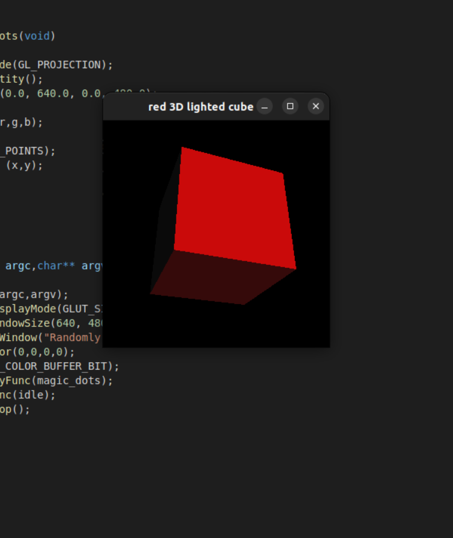
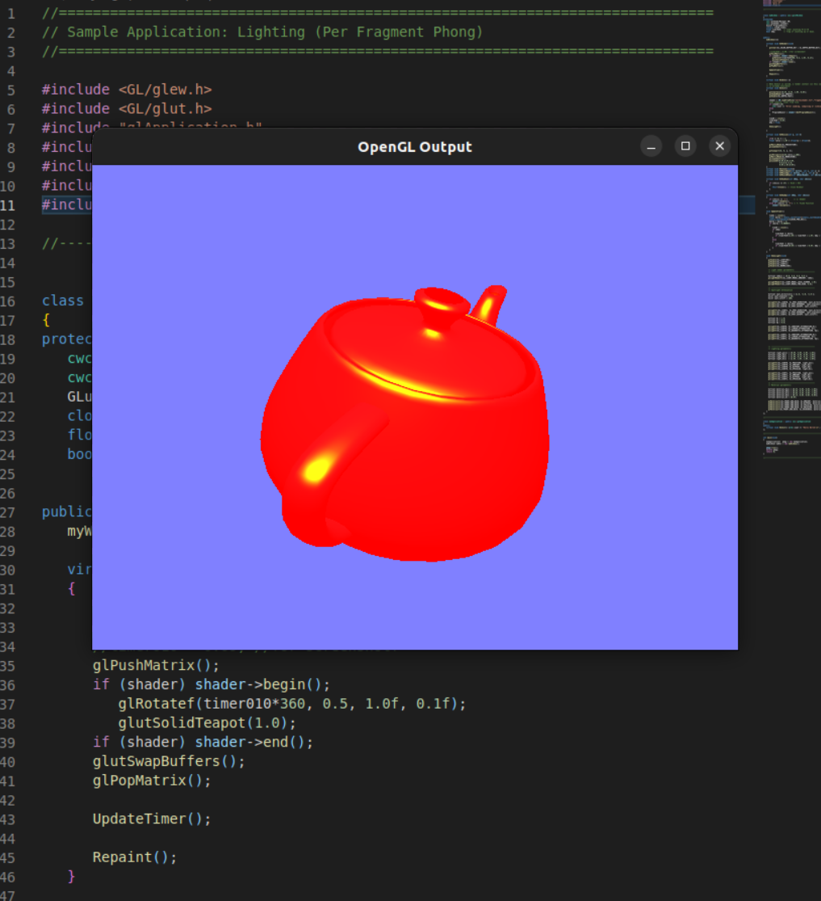
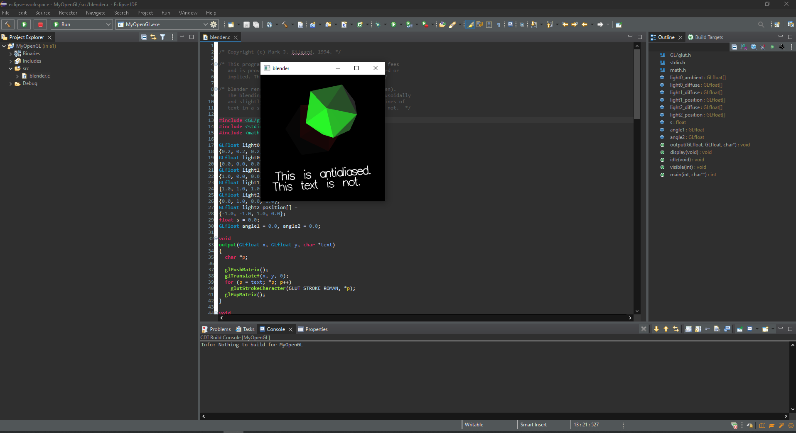
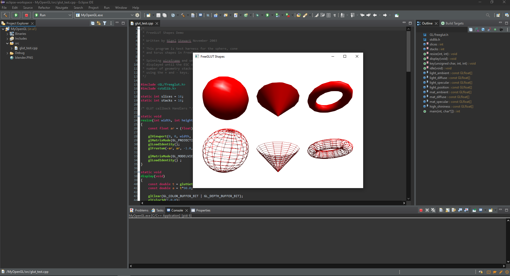

# A1 Report

Author: ???

Date: ???

Check [readme.txt](readme.txt) for course work statement and self-evaluation.

## Q1 Concepts of raster graphics (short answer)

### Q1.1 frame buffer

Framebuffer is a location in memory where the image of a frame is stored. In a graphics card, the final frame is written to the framebuffer to be displayed on the display

### Q1.2 pixel

A pixel is a single point on an image. Typically has x,y coordinates and three color components, one value for red, green, and blue.

### Q1.3 color depth

Color depth is how much information is used to store the color data of a pixel

### Q1.4 resolution

Resolution is the dimension of the image or display, given in pixels.

## Q2 Concepts of raster display (short answer)

### Q2.1 scan line

Scan line is a horiziontal line of a display or image. The concept comes from
CRT displays where each line was drawn by the tube one horiziontal line at a time

### Q2.2 refreshment & refresh rate

Refresh rate is how many times per second, measured in Hz, the display refreshes and draws a new frame

### Q2.3 frame

A frame is a single image that is drawn to a display. It is a 2d collection of pixels and is updated many times per second when using a typical display

## Q3 Roles of CPU and GPU in CG (short answer)

### Q3.1 CPU roles

The CPU processes the model and sends rendering commands to the GPU

### Q3.2 GPU roles

GPU handles the rendering of the model, shading, lighting, etc. Also handles rasterization of the image

## Q4 C/C++ OpenGL programming environment (lab practice)

### Q4.1 C/C++ OpenGL installation

Complete? Yes

{width=90%}
{width=90%}

### Q4.2 OpenGL C project

Complete? Yes

{width=90%}

### Q4.3 OpenGL C++ project

Complete? Yes

{width=90%}
**References**

1. CP411 a1
2. Add your references if you used any.
