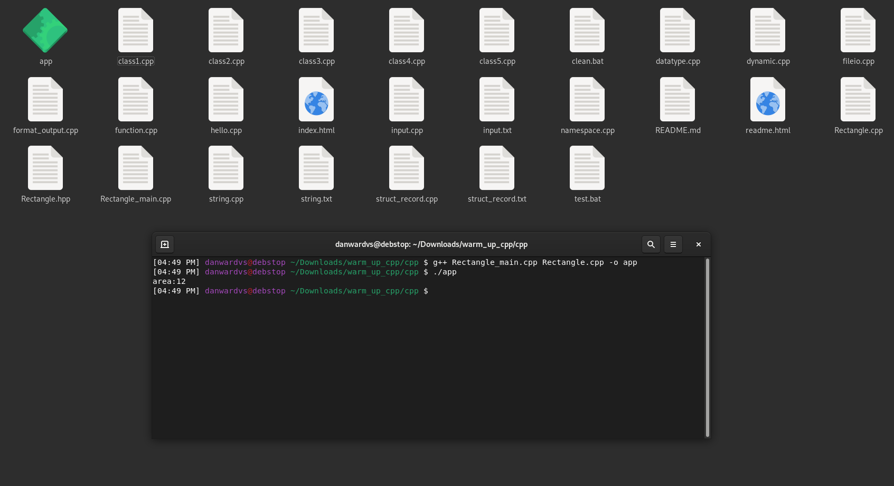
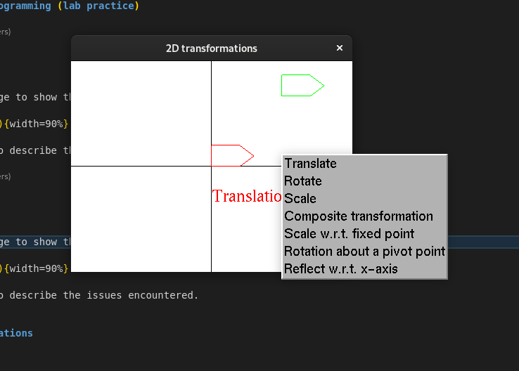
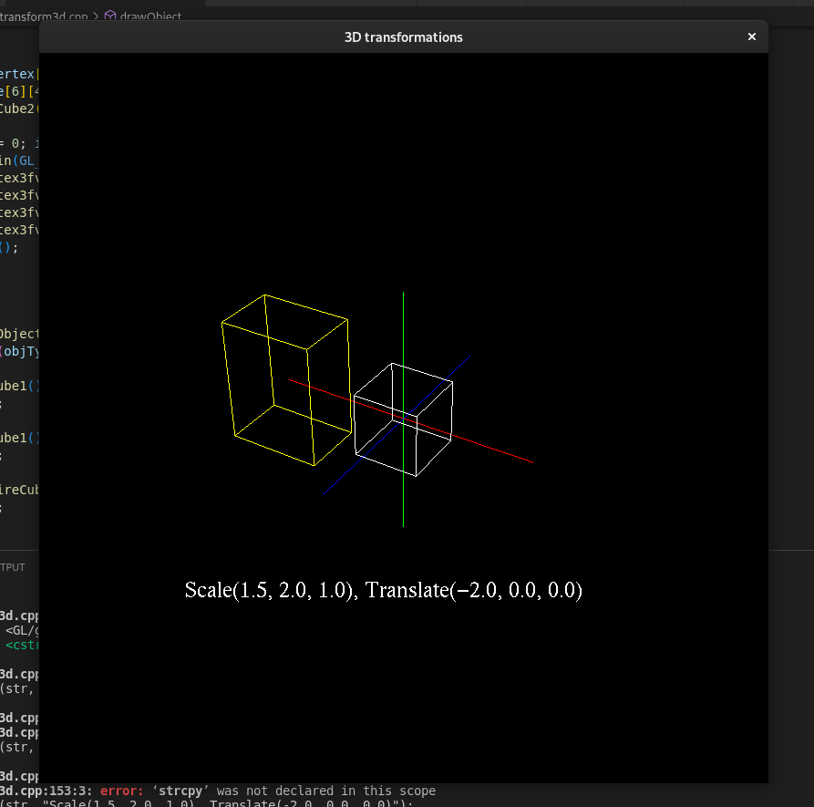
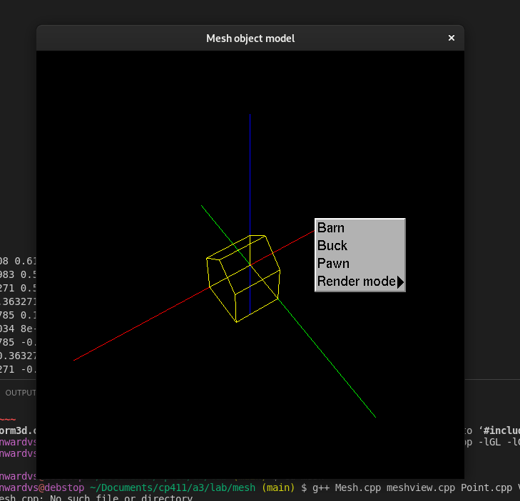

# A3 Report

Author: ???

Date: ???

Check [readme.txt](readme.txt) for course work statement and self-evaluation.

## Q1 Graphics transformations (short_answer)

### Q1.1 Principle of transformations

The three basic transformations are translation, rotation, and scaling
A composite transformation is a combination of basic transformations
Homogeneous coordinate system are more simplistic to use and increases the reliability of the graphics system

### Q1.2 Hand on 2D transformations

1.  rotate pi rads - scale x by 1/2, scale y by 2 - translate y by 3, x by -1
    Homogenous equations | cos(pi) -sin(pi) 0|
    rotation | sin(pi) cos(pi) 0|
    | 0 0 1|

        scaling          | 1/2   0  0|
                         |  0    2  0|
                         |  0    0  1|

        translation      | 1  0  -1 |
                         | 0  1   3 |
                         | 0  0   1 |

## Q2 Graphics transformation programming (lab practice)

### Q2.1 Warm up C++

Complete? (Yes/No)

If Yes, insert a screen shot image to show the completion.

{width=90%}

If No, Add a short description to describe the issues encountered.

### Q2.2 2D transformations

Complete? (Yes/No)

If Yes, insert a screen shot image to show the completion.

{width=90%}

If No, Add a short description to describe the issues encountered.

### Q2.3 3D object and transformations

Complete? (Yes/No)

If Yes, insert a screen shot image to show the completion.

{width=90%}

If No, Add a short description to describe the issues encountered.

### Q2.4 Mesh object model

Complete? (Yes/No)

If Yes, insert a screen shot image to show the completion.

{width=90%}

If No, Add a short description to describe the issues encountered.

## Q3 SimpleView1 - transformations (programming)

### Q3.1 Create and render cube objects

Complete? (Yes/No)

If Yes, insert a screen shot image to show the completion.

[image caption](images/demo.png){width=90%}

If No, add a short description to describe the issues encountered.

### Q3.2 Create and render the pyramid object

Complete? (Yes/No)

If Yes, insert a screen shot image to show the completion.

[image caption](images/demo.png){width=90%}

If No, add a short description to describe the issues encountered.

### Q3.3 Create and render the house object

Complete? (Yes/No)

If Yes, insert a screen shot image to show the completion.

[image caption](images/demo.png){width=90%}

If No, add a short description to describe the issues encountered.

### Q3.4 MCS transforms

Complete? (Yes/No)

If Yes, insert a screen shot image to show the completion.

[image caption](images/demo.png){width=90%}

If No, add a short description to describe the issues encountered.

### Q3.5 WCS transforms

Complete? (Yes/No)

If Yes, insert a screen shot image to show the completion.

[image caption](images/demo.png){width=90%}

If No, add a short description to describe the issues encountered.

### Q3.6 VCS transforms

Complete? (Yes/No)

If Yes, insert a screen shot image to show the completion.

[image caption](images/demo.png){width=90%}

If No, add a short description to describe the issues encountered.

**References**

1. CP411 a3
2. Add your references if you used any.
